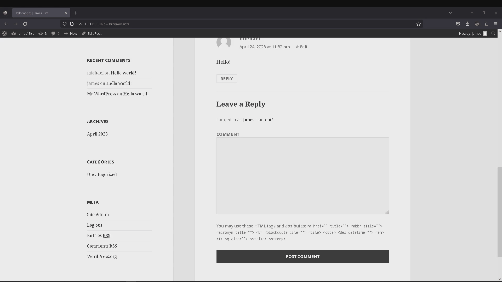
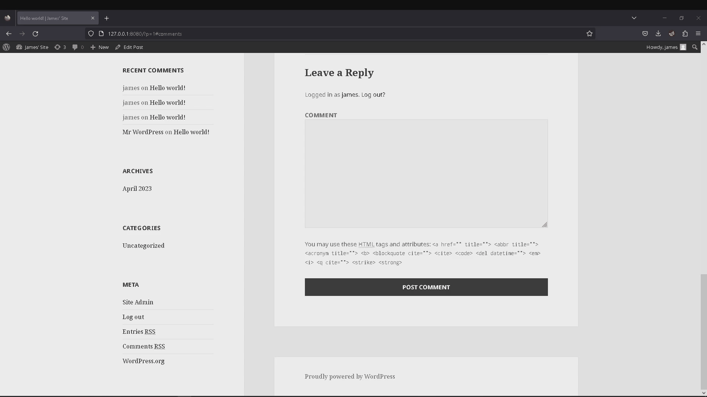
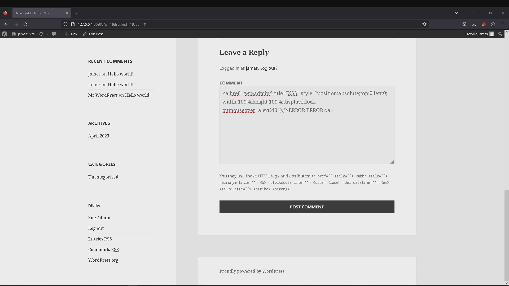

# Project 7 - WordPress Pen Testing

Time spent: **16** hours spent in total

> Objective: Find, analyze, recreate, and document **five vulnerabilities** affecting an old version of WordPress

## Pen Testing Report

### 1. SOME (CVE-2016-4566)

- [ ] Summary: Cross-site scripting (XSS) vulnerability in plupload.flash.swf in Plupload before 2.1.9, as used in WordPress before 4.5.2, allows remote attackers to inject arbitrary web script or HTML via a Same-Origin Method Execution (SOME) attack.
  - Vulnerability types: SOME 
  - Tested in version: 4.1
  - Fixed in version: 4.5.2
- [ ] GIF Walkthrough: 
- [ ] Steps to recreate: Within the replies to a post, enter malicious code into the 'Comment' box
- [ ] Affected source code:
  - [CVE Reference](https://nvd.nist.gov/vuln/detail/CVE-2016-4566)
  
### 2. XSS (CVE-2016-1564)

- [ ] Summary: Cross-site scripting (XSS) vulnerability in wp-includes/wp-db.php in WordPress before 4.2.1 allows remote attackers to inject arbitrary web script or HTML via a long comment that is improperly stored because of limitations on the MySQL TEXT data type.
  - Vulnerability types: XXS 
  - Tested in version: 4.1
  - Fixed in version: 4.2.1
- [ ] GIF Walkthrough: 
- [ ] Steps to recreate: In the replies, inject script to display pop-up box for every refresh.
- [ ] Affected source code:
  - [CVE Reference](https://nvd.nist.gov/vuln/detail/CVE-2016-1564)

### 3. XSS (CVE-2015-5734)
- [ ] Summary: Cross-site scripting (XSS) vulnerability in the legacy theme preview implementation in wp-includes/theme.php in WordPress before 4.2.4 allows remote attackers to inject arbitrary web script or HTML via a crafted string.
  - Vulnerability types: XXS
  - Tested in version: 4.1
  - Fixed in version: 4.2.4
- [ ] GIF Walkthrough: 
- [ ] Steps to recreate: In the replies, inject script to display pop-up box when user reaches the top of the page.
- [ ] Affected source code:
  - [CVE Reference](https://nvd.nist.gov/vuln/detail/CVE-2015-5734)

## Assets

- SOME.html
- refresh.html
- XSS.html

## Resources

- [WordPress](https://core.trac.wordpress.org/browser/)
- [Developer References](https://developer.wordpress.org/reference/)
- [NVD Home](https://nvd.nist.gov/)

GIFs created with  ...

- [ScreenToGif](https://www.screentogif.com/)

## Notes

Throughout the process, I was over complicating things. I didn't realize until I was well into the attacks that there are few
defense mechanisms shown throughout the website, making it a very vulnerable target, even to very simple attacks such as the 
ones I demoed.

## License

    Copyright 2023 James Hernandez

    Licensed under the Apache License, Version 2.0 (the "License");
    you may not use this file except in compliance with the License.
    You may obtain a copy of the License at

        http://www.apache.org/licenses/LICENSE-2.0

    Unless required by applicable law or agreed to in writing, software
    distributed under the License is distributed on an "AS IS" BASIS,
    WITHOUT WARRANTIES OR CONDITIONS OF ANY KIND, either express or implied.
    See the License for the specific language governing permissions and
    limitations under the License.
